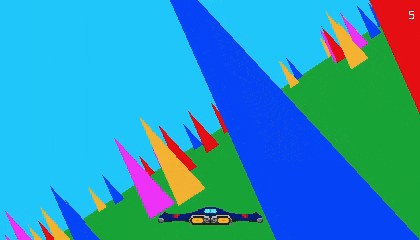

# Jetslalom (Odin Remake)

This repo contains a remake of an old web game called 'Jet slalom'. The goal of the game is to avoid obstacles as long as possible, through increasingly difficult stages.


<p align="center">
  
</p>

This was made to experiment with and learn the [Odin programming language](https://odin-lang.org/).

If you'd like to alter the game, most of the logic is in the [main.odin](https://github.com/heyoeyo/jetslalom_odin/blob/main/src/main.odin) file. The sequence of stages (and how each stage is configured) can be found in the [stage_def.odin](https://github.com/heyoeyo/jetslalom_odin/blob/main/src/stage_def.odin) file.

## How to play

### Online

You can play the game for free on itch.io: https://heyoeyo.itch.io/jetslalom-remake

(Made using the [Odin + Raylib + Web](https://github.com/karl-zylinski/odin-raylib-web) template)

### Download

Pre-built (x86) executables are available for Linux & Windows on the [releases page](https://github.com/heyoeyo/jetslalom_odin/releases).

### Compile

Building/compiling the game requires downloading and [installing Odin](https://odin-lang.org/docs/install/). For reference, I used the [dev-2025-01](https://github.com/odin-lang/Odin/releases/tag/dev-2025-01) release from the odinlang github page (pretty painless).

With Odin installed, simply type the following command (in terminal) from the root folder of the repo:
```bash
odin run src
```
And that's it! This command will compile and immediately run the game.